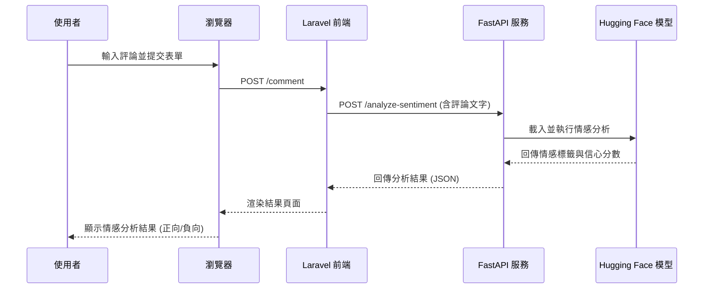

# Laravel-FastAPI-AI 微服務範例

本專案展示一個整合 Laravel（PHP）與 FastAPI（Python）的微服務系統，結合 Hugging Face 模型進行情感分析。Laravel 負責前端與用戶介面，FastAPI 處理 AI 情感分析，透過 Docker 容器化部署，簡單又穩定，適合快速開發與測試。

[](https://php.net)
[](https://laravel.com)
[](https://python.org)
[](LICENSE)

## 功能特色

- **微服務架構**：Laravel 處理前端與用戶介面，FastAPI 負責 AI 情感分析。
- **Docker 整合**：簡化 PHP 和 Python 環境部署，快速啟動。
- **REST API**：Laravel 透過 HTTP 與 FastAPI 溝通，高效傳遞資料。
- **Hugging Face 模型**：採用 `distilbert-base-uncased-finetuned-sst-2-english` 進行情感分析。
- **未來擴展**：可升級至更複雜的 AI 模型，例如即時推薦系統。

## 系統架構圖

以下 Mermaid 序列圖展示用戶提交評論到情感分析的流程，涵蓋前端、Laravel、FastAPI 和 Hugging Face 模型的交互。



## 專案結構

```
.
├── laravel-app/                # Laravel 前端應用
│   ├── app/Http/Controllers/CommentController.php
│   ├── resources/views/comment.blade.php
│   ├── routes/web.php
│   ├── .env.example
│   ├── Dockerfile
│   └── composer.json
├── fastapi-app/                # FastAPI 情感分析微服務
│   ├── main.py
│   ├── requirements.txt
│   ├── .env.example
│   └── Dockerfile
├── docker-compose.yml          # Docker Compose 配置
├── .gitignore                  # Git 忽略文件
└── README.md                   # 專案說明文件
```

## 環境需求

- Docker
- Docker Compose
- Git

## 安裝步驟

### 1. 複製專案

```bash
git clone https://github.com/BpsEason/laravel-fastapi-ai.git
cd laravel-fastapi-ai
```

### 2. 建立 Laravel 專案（若尚未建立）

```bash
cd laravel-app
docker run --rm -v $(pwd):/app composer create-project laravel/laravel .
```

### 3. 安裝 GuzzleHTTP（Laravel HTTP 客戶端）

```bash
cd laravel-app
docker run --rm -v $(pwd):/app composer require guzzlehttp/guzzle
```

### 4. 設定環境變數

複製環境檔案：

```bash
cp laravel-app/.env.example laravel-app/.env
cp fastapi-app/.env.example fastapi-app/.env
```

編輯 `laravel-app/.env` 關鍵配置：

```env
APP_ENV=local
APP_KEY= # 安裝後生成
APP_URL=http://localhost:8000
FASTAPI_URL=http://fastapi:8001
```

編輯 `fastapi-app/.env` 關鍵配置：

```env
CORS_ALLOW_ORIGIN=http://localhost:8000
```

### 5. 生成 Laravel 應用密鑰

```bash
cd laravel-app
docker run --rm -v $(pwd):/app composer php artisan key:generate
```

### 6. 複製必要檔案

確保以下檔案位於正確目錄：
- `laravel-app/`：`CommentController.php`、`comment.blade.php`、`web.php`、`composer.json`、`Dockerfile`
- `fastapi-app/`：`main.py`、`requirements.txt`、`Dockerfile`
- 專案根目錄：`docker-compose.yml`、`.gitignore`

### 7. 建構並啟動服務

```bash
docker-compose up --build -d
```

服務包含：
- Laravel 前端：`http://localhost:8000`
- FastAPI 文件：`http://localhost:8001.docs`

## 使用方式

1. 開啟瀏覽器，訪問 `http://localhost:8000`。
2. 輸入評論（例如「我很喜歡這個產品！」或「這太糟糕了。」）。
3. 提交表單，查看情感分析結果（正向/負向）及信心分數。

## 測試

測試 FastAPI 情感分析端點：

```bash
curl -X POST http://localhost:8001/analyze-sentiment/ -H "Content-Type: application/json" -d '{"text":"I love this product!"}'
```

預期回應：

```json
{"label":"POSITIVE","score":0.9998981952667236}
```

## Docker Compose 常用指令

- 停止服務：`docker-compose down`
- 查看日誌：`docker-compose logs laravel` 或 `docker-compose logs fastapi`
- 重建服務：`docker-compose build`
- 重啟服務：`docker-compose restart`

## 未來擴展

- 升級 FastAPI 使用更進階的 AI 模型（例如 BERT 或 GPT，支援推薦系統）。
- 加入 Redis 快取，優化情感分析效能。
- 實作 OAuth2 認證，增強 API 安全性。
- 擴展至即時推薦系統，基於用戶評論進行個人化推薦。

## 問題排查

- **Laravel 錯誤**：檢查 `laravel-app/storage/logs/laravel.log`。
- **FastAPI 錯誤**：執行 `docker-compose logs fastapi` 查看容器日誌。
- **CORS 問題**：確認 `fastapi-app/.env` 中的 `CORS_ALLOW_ORIGIN` 設置正確。
- **模型載入問題**：確保系統有足夠記憶體（建議 4GB+ RAM）及穩定網路以載入 Hugging Face 模型。

## 授權

[MIT License](LICENSE)

## 注意事項

- 感謝您使用本專案！若有問題，歡迎透過 GitHub Issues 反饋。
- 本系統感謝 Laravel 提供穩健的前端框架，FastAPI 提供高效的 Python 微服務，以及 Hugging Face 提供強大的情感分析模型。
